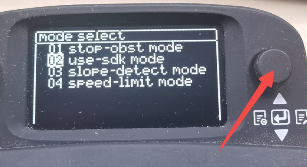

<p align="center"><strong>TITA-SDK-ROS2</strong></p>
<p align="center"><a href="https://github.com/DDTRobot/TITA-SDK-ROS2/blob/main/LICENSE"></a>


</p>
<p align="center">
    语言：<a href="./docs/docs_cn/README_CN.md"><strong>中文</strong></a> / <a href="/README.md"><strong>English</strong>
</p>

​	SDK Demo for TITA Ubuntu

## Basic Information

| Installation method | Supported platform[s]    |
| ------------------- | ------------------------ |
| Source              | Jetpack 6.0 , ros-humble |

------

## Published

|       ROS Topic        |                   Interface                    | Frame ID |    Description    |
| :--------------------: | :--------------------------------------------: | :------: | :---------------: |
| `command/user/command` | `tita_locomotion_interfaces/msg/LocomotionCmd` |  `cmd`   | User SDK control instructions |

## Build Package

```bash
mkdir -p tita_sdk/src
cd tita_sdk/src
git clone https://github.com/DDTRobot/TITA-SDK-ROS2.git
colcon build
source install/setup.bash
ros2 launch tita_bringup sdk_launch.py
```

## Config 

|       Param       |      Range      | Default |                    Description                     |
| :---------------: | :-------------: | :-----: | :------------------------------------------------: |
|  `sdk_max_speed`  |      `3.0`      |  `3.0`  |              Speed limit，3.0 m/s                  |
| `turn_max_speed`  |      `6.0`      |  `6.0`  |              Rotation speed limit，6.0 rad/s                  |
|  `pub_freq`       |  [100.0,170.0]  |  `170`  | Release frequency, unit Hz, range [100.0,170.0]                  |    
| `height_max` | [0.0,0.3]     |  `0.3`  |  Corresponding to the highest height of the remote control, the distance between the wheel axle and the center of the vehicle body 0.3 m                              |
| `height_min`     |  [0.0,0.3]          |  `0.2`  |    Corresponding to the middle height shielding position of the remote control, the distance between the wheel axle and the center of the vehicle body 0.2m                         |
| `height_min` |   [0.0,0.3]   |  `0.1`  |    Corresponding to the remote control's lowest height blocking position, the distance between the wheel axle and the center of the vehicle body 0.1 m                     |
|`pitch_max_pose`|   `1.0`  |  `1.0`  | The maximum pitch angle of the robot, in rad, range [-1.0,1.0] |             |    

## Quick Start

* Press the small buttons on the right side of the small screen on the remote control, press it in the middle, appear, the "mode select" interface

* In the use button to push down, select the USE-SDK Mode Press, the robot will be automatically executed, and the use-SDK will take over the control permissions.


## FAQ
1. If ros2 Launch tita_bringup sdk_launch.py ​​exits, the robot will still be executed automatically, unless the user-SDK control permissions are released
2. If the robot has no response ,angular.z value in sdk_command_node.cpp is too small