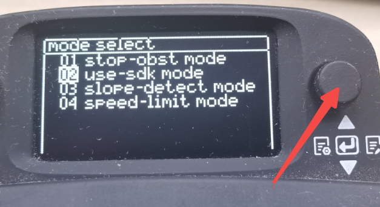
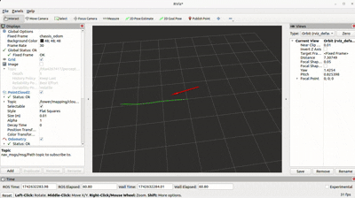

<p align="center"><strong>TITA-SDK-ROS2</strong></p>
<p align="center"><a href="https://github.com/DDTRobot/TITA-SDK-ROS2/blob/main/LICENSE"></a>


</p>
<p align="center">
    语言：<a href="./docs/docs_cn/README_CN.md"><strong>中文</strong></a> / <a href="/README.md"><strong>English</strong>
</p>

​	TITA Ubuntu 系统的 SDK Demo.

## 基本信息

| Installation method | Supported platform[s]    |
| ------------------- | ------------------------ |
| Source              | Jetpack 6.0 , ros-humble |

------

## 发布的 ROS2 Topic

|       ROS Topic        |                   Interface                    | Frame ID |    Description    |
| :--------------------: | :--------------------------------------------: | :------: | :---------------: |
| `command/user/command` | `tita_locomotion_interfaces/msg/LocomotionCmd` |  `cmd`   | 用户 SDK 控制指令 |

## 构建包

```bash
mkdir -p tita_sdk/src
cd tita_sdk/src
git clone https://github.com/DDTRobot/TITA-SDK-ROS2.git
colcon build
source install/setup.bash
ros2 launch tita_bringup sdk_launch.py
```

## 配置 

|       Param       |      Range      | Default |                    Description                     |
| :---------------: | :-------------: | :-----: | :------------------------------------------------: |
|  `sdk_max_speed`  |      `3.0`      |  `3.0`  |              机器的速度上限，3.0 m/s                  |
| `turn_max_speed`  |      `6.0`      |  `6.0`  |              旋转速度上限，6.0 rad/s                  |
|  `pub_freq`       |  [100.0,170.0]  |  `170`  | 发布频率，单位 Hz，范围 [100.0,170.0]                  |    
| `height_max` | [0.0,0.3]     |  `0.3`  |  对应遥控器最高高度挡位，轮轴与车身中心的距离0.3 m                              |
| `height_min`     |  [0.0,0.3]          |  `0.2`  |    对应遥控器中间高度挡位，轮轴与车身中心的距离0.2m                         |
| `height_min` |   [0.0,0.3]   |  `0.1`  |    对应遥控器最低高度挡位，轮轴与车身中心的距离0.1 m                     |
|`pitch_max_pose`|   `1.0`  |  `1.0`  | 机器人最大俯仰角度，单位 rad，范围 [-1.0,1.0] |
## 快速开始

* 按一下遥控器小屏幕右侧的小按钮，按到中间，出现“mode select”界面



* 使用按钮往下推，选中use-sdk mode 按下，机器人将自动执行，由use-sdk 接管控制权限，此时用遥控器无法做控制


## FAQ

1. 如果ros2 launch tita_bringup sdk_launch.py退出后，机器人仍然会自动执行，除非释放use-sdk控制权限
2. 如果出现机器人没有反应，sdk_command_node.cpp中angular.z值给太小了


## 二、轨迹跟踪功能

## 构建包
```bash
mkdir -p tita_sdk/src
cd tita_sdk/src
git clone https://github.com/DDTRobot/TITA-SDK-ROS2.git
colcon build
source install/setup.bash
```
### 轨迹录制 
1. 启动轨迹录制节点
```bash
ros2 launch path_controller. path_controller.launch.py
```
2. 开始轨迹录制，即将遥控器控制机器人行走轨迹录制下来
```bash
ros2 service call /{namespace}/start_record_path std_srvs/srv/Trigger {}
```
3. 保存轨迹，即将遥控器控制机器人停止后，保存轨迹
```bash 
 ros2 service call /{namespace}/end_record_path std_srvs/srv/Trigger {}
```
4. 轨迹保存路径为/home/{username}/path2.pkl
### 轨迹回放
1. 启动轨迹跟踪节点
```bash
ros2 launch path_follower path_follower.launch.py
```
2. 确保主机与tita在一个网段，同一ROS_DOMAIN_ID（便于调整一些参数），如果有线连接也可以，确保在主机上能找到ros话题,使用Rviz2 可视化轨迹


